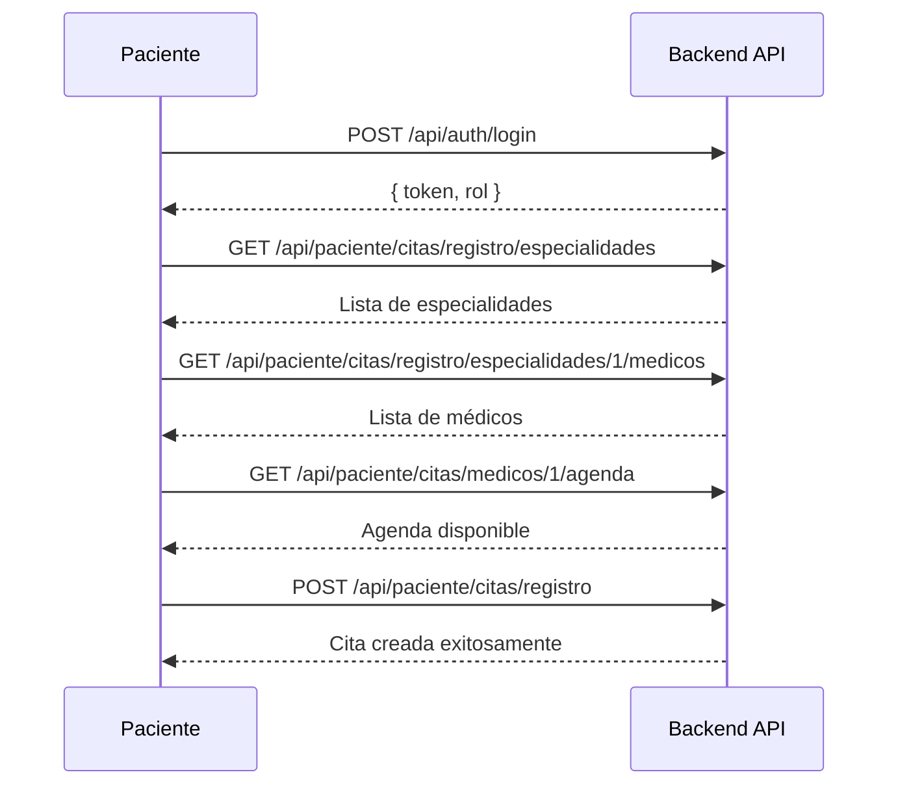
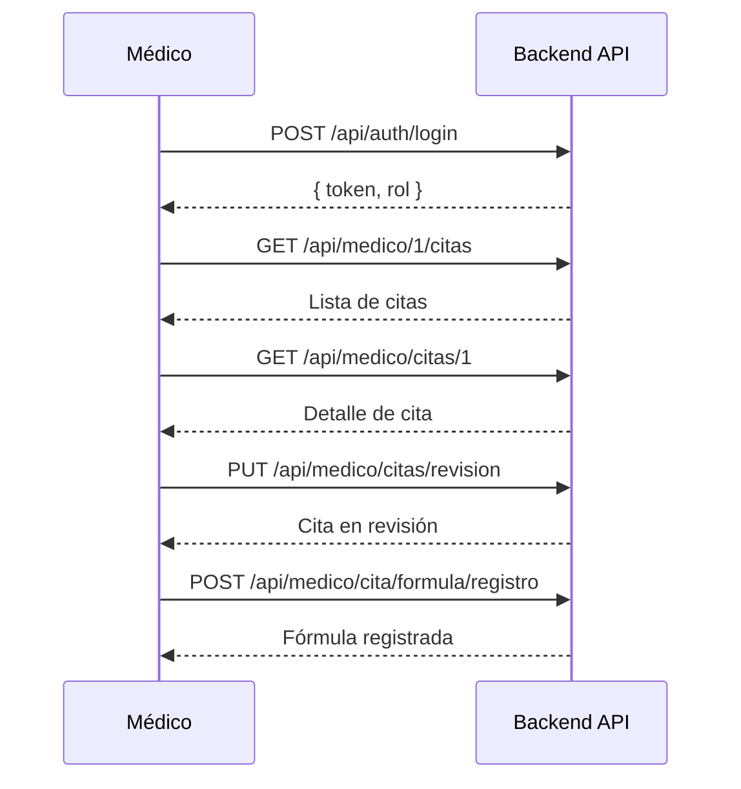

# Guía Rápida de API para Frontend - VitalApp

## 🎯 Información Esencial

### URL Base
```
Desarrollo: http://localhost:8080
Producción: [TU_URL_DE_PRODUCCION]
```

### Autenticación
Todas las peticiones (excepto login y health) requieren el header:
```
Authorization: Bearer {token}
```

## 🔑 Autenticación

### Login
```http
POST /api/auth/login
Content-Type: application/json

{
  "email": "usuario@example.com",
  "password": "password123"
}
```

**Respuesta:**
```json
{
  "error": false,
  "respuesta": {
    "token": "eyJhbGciOiJIUzI1NiIsInR5cCI6IkpXVCJ9...",
    "rol": "ROLE_PACIENTE"
  }
}
```

**Roles posibles:**
- `ROLE_ADMIN` - Administrador
- `ROLE_MEDICO` - Médico
- `ROLE_PACIENTE` - Paciente

## 👤 Endpoints por Rol

### 🏥 ADMIN

#### Gestión de Pacientes
```http
# Registrar paciente
POST /api/admin/paciente/registro

# Listar pacientes (con paginación)
GET /api/admin/paciente/listar?pagina=0&size=10

# Ver paciente
GET /api/admin/paciente/{id}

# Buscar por email
GET /api/admin/paciente/buscar-email?email=ejemplo@email.com

# Ver citas del paciente
GET /api/admin/paciente/{id}/citas

# Ver fórmulas del paciente
GET /api/admin/paciente/{id}/formula
```

#### Gestión de Médicos
```http
# Registrar médico
POST /api/admin/medico/registro

# Listar médicos (con paginación y filtros)
GET /api/admin/medico/listar?pagina=0&size=10&idEspecialidad=1

# Ver médico
GET /api/admin/medico/{id}

# Buscar por email
GET /api/admin/medico/buscar-email?email=doctor@hospital.com

# Ver agenda del médico
GET /api/admin/medicos/{id}/agenda

# Ver citas del médico
GET /api/admin/medico/{id}/citas

# Eliminar médico
DELETE /api/admin/medico/eliminar-perfil
```

#### Gestión de Catálogos
```http
# EPS
POST /api/admin/eps/registrar
GET /api/admin/eps/listar

# Especialidades
POST /api/admin/especialidad/registro
GET /api/admin/especialidad/listar

# Medicamentos
POST /api/admin/medicamento/registro
GET /api/admin/medicamento/listar
```

---

### 👨‍⚕️ MEDICO

#### Perfil
```http
# Ver mi perfil
GET /api/medico/{id}

# Editar perfil
PUT /api/medico/editar-perfil

# Cambiar email
PUT /api/medico/editar-email

# Cambiar contraseña
PUT /api/medico/editar-password

# Ver mi agenda
GET /api/medico/{id}/agenda
```

#### Citas
```http
# Ver mis citas
GET /api/medico/{id}/citas

# Ver detalle de cita
GET /api/medico/citas/{id}

# Poner cita en revisión
PUT /api/medico/citas/revision
Body: { "idCita": 1 }

# Registrar fórmula médica
POST /api/medico/cita/formula/registro
```

---

### 🧑‍🤝‍🧑 PACIENTE

#### Perfil
```http
# Ver mi perfil
GET /api/paciente/{id}

# Editar perfil
PUT /api/paciente/editar-perfil

# Cambiar email
PUT /api/paciente/editar-email

# Cambiar contraseña
PUT /api/paciente/editar-password

# Eliminar cuenta
DELETE /api/paciente/eliminar-perfil
```

#### Citas
```http
# Ver especialidades disponibles
GET /api/paciente/citas/registro/especialidades

# Ver médicos por especialidad
GET /api/paciente/citas/registro/especialidades/{id}/medicos

# Ver agenda disponible del médico
GET /api/paciente/citas/medicos/{id}/agenda

# Agendar cita
POST /api/paciente/citas/registro

# Ver mis citas
GET /api/paciente/{id}/citas

# Ver citas pendientes
GET /api/paciente/{id}/citas/pendientes

# Ver detalle de cita
GET /api/paciente/citas/{id}

# Cancelar cita
PUT /api/paciente/citas/cancelar
Body: { "idCita": 1 }
```

#### Fórmulas Médicas
```http
# Ver mis fórmulas
GET /api/paciente/{id}/formula

# Ver detalle de fórmula
GET /api/paciente/formula/{id}

# Ver medicamentos de la fórmula
GET /api/paciente/formula/{id}/detalles
```

## 📋 Estructuras de Datos Importantes

### Registrar Paciente
```json
{
  "nombre": "María García",
  "crearUserDto": {
    "email": "maria.garcia@email.com",
    "password": "password123"
  },
  "idEps": 1,
  "idCiudad": 1,
  "telefonos": [
    { "numero": "3109876543" }
  ]
}
```

### Registrar Médico
```json
{
  "nombre": "Dr. Juan Pérez",
  "user": {
    "email": "dr.juanperez@hospital.com",
    "password": "password123"
  },
  "telefonos": [
    { "numero": "3001234567" }
  ],
  "idEspecialidad": 1
}
```

### Agendar Cita
```json
{
  "observaciones": "Dolor de cabeza persistente",
  "idPaciente": 1,
  "idMedico": 1,
  "idAgenda": 1
}
```

### Registrar Fórmula Médica
```json
{
  "idPaciente": 1,
  "idCita": 1,
  "detallesFormula": [
    {
      "cantidad": 1,
      "observaciones": "Tomar cada 8 horas",
      "dosis": "400mg",
      "idMedicamento": 1
    }
  ]
}
```

### Editar Perfil Paciente
```json
{
  "id": 1,
  "nombre": "María Isabel García",
  "idCiudad": 2
}
```

### Editar Perfil Médico
```json
{
  "id": 1,
  "password": "password123",
  "nombre": "Dr. Juan Carlos Pérez"
}
```

### Cambiar Email
```json
{
  "id": 1,
  "emailNuevo": "nuevo.email@example.com",
  "password": "password123"
}
```

### Cambiar Contraseña
```json
{
  "id": 1,
  "antiguoPassword": "password123",
  "nuevoPassword": "newpassword456"
}
```

## 🎨 Flujos Principales de Usuario

### 📱 Flujo: Paciente Agenda una Cita



### 👨‍⚕️ Flujo: Médico Atiende Paciente



## 🔐 Manejo de Autenticación en Frontend

### Guardar Token (ejemplo en JavaScript)
```javascript
// Después del login exitoso
const response = await fetch('http://localhost:8080/api/auth/login', {
  method: 'POST',
  headers: { 'Content-Type': 'application/json' },
  body: JSON.stringify({ email, password })
});

const data = await response.json();

if (!data.error) {
  // Guardar en localStorage o sessionStorage
  localStorage.setItem('token', data.respuesta.token);
  localStorage.setItem('rol', data.respuesta.rol);
}
```

### Usar Token en Peticiones
```javascript
const token = localStorage.getItem('token');

const response = await fetch('http://localhost:8080/api/paciente/1', {
  method: 'GET',
  headers: {
    'Authorization': `Bearer ${token}`,
    'Content-Type': 'application/json'
  }
});

const data = await response.json();
```

### Verificar Rol
```javascript
const rol = localStorage.getItem('rol');

if (rol === 'ROLE_ADMIN') {
  // Mostrar panel de administrador
} else if (rol === 'ROLE_MEDICO') {
  // Mostrar panel de médico
} else if (rol === 'ROLE_PACIENTE') {
  // Mostrar panel de paciente
}
```

## ⚠️ Manejo de Errores

### Códigos de Estado HTTP
- `200 OK` - Petición exitosa
- `401 Unauthorized` - Token inválido o expirado
- `403 Forbidden` - Sin permisos para el recurso
- `404 Not Found` - Recurso no encontrado
- `500 Internal Server Error` - Error del servidor

### Estructura de Error
```json
{
  "error": true,
  "respuesta": "Mensaje de error descriptivo"
}
```

### Ejemplo de Manejo de Errores
```javascript
try {
  const response = await fetch(url, options);
  const data = await response.json();
  
  if (response.status === 401) {
    // Token expirado, redirigir al login
    logout();
    redirectToLogin();
  } else if (data.error) {
    // Mostrar mensaje de error al usuario
    showError(data.respuesta);
  } else {
    // Proceso exitoso
    return data.respuesta;
  }
} catch (error) {
  // Error de red o servidor
  showError('Error de conexión con el servidor');
}
```

## 📊 Paginación

Los endpoints de listado usan paginación:

```http
GET /api/admin/paciente/listar?pagina=0&size=10
```

**Parámetros:**
- `pagina`: Número de página (comienza en 0)
- `size`: Cantidad de elementos por página
- Otros filtros específicos del endpoint

## 🧪 Swagger/OpenAPI

Documentación interactiva disponible en:
```
http://localhost:8080/swagger-ui.html
```

## 📝 Notas Importantes

1. **Validaciones**: Todos los campos marcados con `@NotNull`, `@NotBlank`, etc. son obligatorios
2. **Contraseñas**: Mínimo 8 caracteres
3. **Emails**: Deben tener formato válido
4. **Teléfonos**: Deben registrarse al menos uno al crear usuarios
5. **IDs**: Todos los IDs son de tipo `Long` (números enteros)
6. **Fechas**: Formato ISO 8601 (ej: "2025-10-19T14:30:00")

## 🔄 CORS

El backend ya tiene CORS configurado para aceptar peticiones desde cualquier origen (`*`). En producción esto debería restringirse.

## 🆘 Contacto

Para dudas o problemas con la API, contactar al equipo de backend.

---

**Versión del Documento**: 1.0  
**Fecha**: Octubre 2025


